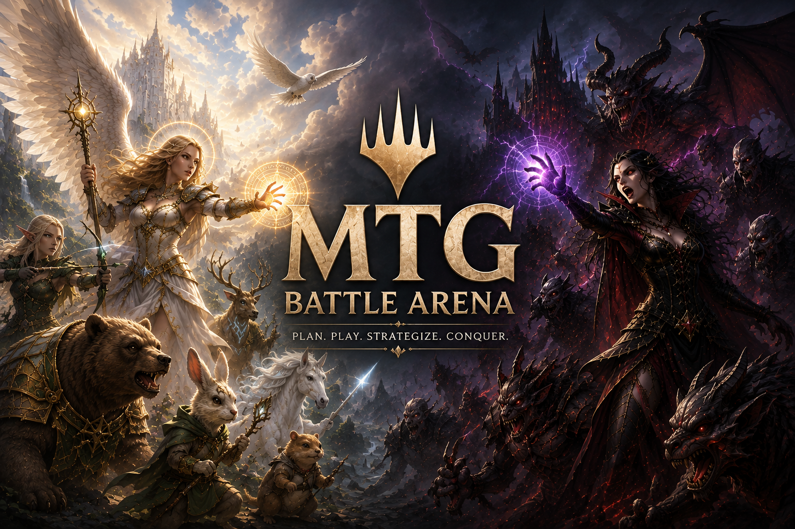

<a id="readme-top"></a>

<div align="center">



<br />

# ⚔️ MTG Battle Mode

### Een local-first digitale tafel voor Magic: The Gathering

**Speel volledig offline of ga online met 2–6 spelers — zonder van de browser een automatische rules engine te maken.**

<br />

[![CI][ci-shield]][ci-url]
[![Beta][beta-shield]][beta-url]
[![Production][production-shield]][production-url]

<br />

[**🚀 Quick Start**](#-quick-start)
&nbsp;&nbsp;•&nbsp;&nbsp;
[**🏗️ Architectuur**](#️-architectuur)
&nbsp;&nbsp;•&nbsp;&nbsp;
[**🔄 CI/CD**](#-cicd)
&nbsp;&nbsp;•&nbsp;&nbsp;
[**🗺️ Roadmap**](#️-roadmap)
&nbsp;&nbsp;•&nbsp;&nbsp;
[**📚 Docs**](#-documentatie)

</div>

---

> [!NOTE]
> **MTG Battle Mode is een handmatige digitale tafel, geen Magic rules engine.**
> Spelers voeren zelf acties uit zoals kaarten verplaatsen, tappen, leven aanpassen,
> counters beheren, mulligans uitvoeren en beurten doorlopen.

## ✨ Waarom MTG Battle Mode?

| | |
|---|---|
| 📴 **Local-first** | Start en hervat battles zonder account of backend. |
| 🃏 **Archidekt import** | Importeer openbare decks en werk met lokale snapshots. |
| 💾 **Autosave & recovery** | Game-state, undo/redo en deckdata blijven lokaal beschikbaar. |
| 📦 **Offline ready** | PWA + expliciete offlinepakketten met kaartdata en afbeeldingen. |
| 👥 **2–6 spelers** | Commander-ready multiplayer met vier spelers als belangrijke use-case. |
| 🔐 **Privacy by design** | Online spelers ontvangen alleen de state die zij mogen zien. |
| ☁️ **Server authoritative** | Firebase verzorgt identiteit; Cloudflare beheert de officiële online game-state. |
| 🎮 **Digitale tafel** | Geen automatische mana-, combat-, trigger- of kaartregelvalidatie. |

---

## 📊 Projectstatus

### Legenda

| Status | Betekenis |
|---|---|
| 🟢 **Ready** | Beschikbaar en onderdeel van de huidige applicatie |
| 🟡 **In progress** | Actieve uitbreidingsrichting |
| 🔵 **Automated** | Geautomatiseerd via GitHub Actions |
| ⚪ **Planned** | Bewust later gepland |

| Onderdeel | Status |
|---|---|
| Offline battle voor 2–6 spelers | 🟢 **Ready** |
| Archidekt-import | 🟢 **Ready** |
| Autosave, hervatten en undo/redo | 🟢 **Ready** |
| Offlinepakket en PWA | 🟢 **Ready** |
| Commander-zones en statustracking | 🟢 **Ready** |
| Online lobby & multiplayerbasis | 🟢 **Ready** |
| Server-authoritative game-core | 🟢 **Ready** |
| CI-validatie op pull requests | 🔵 **Automated** |
| Beta deployment vanaf `staging` | 🔵 **Automated** |
| Production deployment vanaf `main` | 🔵 **Automated** |
| Verdere online game-acties | 🟡 **In progress** |

<details>
<summary><strong>Wat kan de online game-core momenteel?</strong></summary>

<br />

De online architectuur gebruikt versioned commands en persoonlijke serverviews.
De server bewaart de officiële game-state en stuurt tegenstanders nooit verborgen
hand- of librarymetadata.

De huidige richting ondersteunt onder andere:

- kaarten trekken en verplaatsen;
- leven en poison aanpassen;
- millen en schudden;
- beurtwissels;
- persoonlijke openingshanden en mulligans;
- lobby-, seat- en reconnectflows;
- gescheiden views voor spelers en spectators.

De applicatie blijft bewust een **handmatige tafel** en automatiseert geen volledige
Magic-regels.

</details>

<p align="right">(<a href="#readme-top">terug naar boven</a>)</p>

---

## 🚀 Quick Start

**Vereisten:** Node.js 22+ en npm.

```sh
git clone https://github.com/MarcoHuib/mtgbattlearena.git
cd mtgbattlearena

npm ci
npm run dev
```

Open daarna de URL die Vite in de terminal toont.

> [!TIP]
> De offline flow werkt zonder productie-secrets, Firebase-login of actieve
> Cloudflare-backend.

<details>
<summary><strong>🎮 Belangrijkste bediening</strong></summary>

<br />

- Sleep kaarten tussen hand, battlefield en andere zones.
- Dubbelklik een battlefieldkaart om deze te tappen of untappen.
- Gebruik rechtermuisklik of `Shift+F10` voor het toegankelijke kaartmenu.
- Gebruik Ctrl/⌘-klik of tik om meerdere kaarten te selecteren.
- Open het librarymenu voor draw X, mill X, zoeken en schudden.
- Gebruik contextacties voor zones, tokens en aanvullende kaartacties.

</details>

<p align="right">(<a href="#readme-top">terug naar boven</a>)</p>

---

## 🏗️ Architectuur

<div align="center">

**Offline waar het kan. Server-authoritative waar het moet.**

</div>

```text
┌──────────────────────────────────────────────────────────────┐
│                         React Web                            │
│                Vite · Redux Toolkit · PWA                   │
└───────────────────────┬──────────────────────────────────────┘
                        │
          ┌─────────────┴─────────────┐
          │                           │
          ▼                           ▼
┌─────────────────────┐     ┌─────────────────────────────┐
│   OFFLINE RUNTIME   │     │       ONLINE RUNTIME        │
│                     │     │                             │
│ Redux / game-core   │     │ Firebase Authentication     │
│ IndexedDB           │     │ Cloudflare Game Worker      │
│ PWA / asset cache   │     │ Durable Objects + SQLite    │
└─────────────────────┘     └──────────────┬──────────────┘
                                          │
                                          ▼
                              ┌─────────────────────────┐
                              │ Personal server views   │
                              │ Versioned commands      │
                              │ WebSocket reconnect     │
                              └─────────────────────────┘
```

<details>
<summary><strong>📁 Repositorystructuur</strong></summary>

<br />

```text
apps/
├── web/             React, Redux, IndexedDB, PWA en Playwright
├── game-worker/     Firebase-validatie, WebSockets en Durable Objects
└── import-worker/   Afgeschermde Archidekt importproxy

packages/
├── game-core/       Pure game-state en domeinlogica
└── game-protocol/   Zod-commands, snapshots, events en errors

docs/
├── architecture/    Architecture Decision Records
├── legal/           Privacy, voorwaarden en third-party notices
└── reference/       Visuele referenties
```

De webapp en Game Worker delen dezelfde pure `game-core` en hetzelfde
runtime-gevalideerde protocol.

- **Offline:** Redux is authoritative.
- **Online:** de server is authoritative en Redux bevat alleen de persoonlijke clientview.
- **Import:** externe Archidekt-data loopt via een begrensde Worker/BFF.

</details>

<details>
<summary><strong>📐 Architecture Decision Records</strong></summary>

<br />

- [Local-first grenzen](docs/architecture/001-local-first-boundaries.md)
- [Game actions](docs/architecture/002-phase-two-game-actions.md)
- [Zones, attachments en groepen](docs/architecture/003-zone-management-attachments-groups.md)
- [Contextacties en tokens](docs/architecture/004-context-actions-and-deck-tokens.md)
- [Speler- en matchstatus](docs/architecture/005-player-and-match-status.md)
- [Online multiplayer](docs/architecture/006-online-multiplayer.md)
- [Gedeelde offline/online speeltafel](docs/architecture/007-shared-battle-runtime.md)

</details>

<p align="right">(<a href="#readme-top">terug naar boven</a>)</p>

---

## 🔄 CI/CD

<div align="center">

### Deployment pipeline

<table>
<tr>
<td align="center" width="28%">

### 🔍 CI

[![CI][ci-large-shield]][ci-url]

**Pull Request**

`feature/*`

⬇

`staging` / `main`

<sub>Lint · Typecheck · Tests · Build · Security</sub>

</td>

<td align="center" width="8%">

# ➜

</td>

<td align="center" width="28%">

### 🧪 BETA

[![Beta][beta-large-shield]][beta-url]

**Test environment**

`staging`

🌐 **beta.mtgbattlearena.nl**

<sub>Firebase Hosting · Cloudflare Staging · Isolated Durable Objects</sub>

</td>

<td align="center" width="8%">

# ➜

</td>

<td align="center" width="28%">

### 🚀 PRODUCTION

[![Production][production-large-shield]][production-url]

**Live environment**

`main`

🌐 **mtgbattlearena.nl**

<sub>Firebase Hosting · Cloudflare Production · Production Durable Objects</sub>

</td>
</tr>
</table>

<br />

**Development** `local`
&nbsp;&nbsp;→&nbsp;&nbsp;
**Validation** `pull request`
&nbsp;&nbsp;→&nbsp;&nbsp;
**Test** `staging`
&nbsp;&nbsp;→&nbsp;&nbsp;
**Production** `main`

</div>

> [!IMPORTANT]
> De workflowstatussen hierboven zijn live GitHub Actions-badges.
> Een pull request valideert alleen; deployment begint pas na een push/merge naar
> `staging` of `main`.

### Omgevingen

<table>
<tr>
<th align="left">Omgeving</th>
<th align="left">Branch</th>
<th align="left">Frontend</th>
<th align="left">API</th>
<th align="left">WebSocket</th>
<th align="center">Deployment</th>
</tr>
<tr>
<td>🧪 <strong>Beta</strong></td>
<td><code>staging</code></td>
<td><code>beta.mtgbattlearena.nl</code></td>
<td><code>api.beta.mtgbattlearena.nl</code></td>
<td><code>ws.beta.mtgbattlearena.nl</code></td>
<td align="center"><a href="https://github.com/MarcoHuib/mtgbattlearena/actions/workflows/deploy-beta.yml"></a></td>
</tr>
<tr>
<td>🚀 <strong>Production</strong></td>
<td><code>main</code></td>
<td><code>mtgbattlearena.nl</code></td>
<td><code>api.mtgbattlearena.nl</code></td>
<td><code>ws.mtgbattlearena.nl</code></td>
<td align="center"><a href="https://github.com/MarcoHuib/mtgbattlearena/actions/workflows/deploy-production.yml"></a></td>
</tr>
</table>

> [!TIP]
> Wil je later ook **Build #123** of een applicatieversie zoals **v0.8.4** in deze
> blokken tonen, laat de deployment-workflows dan tijdens iedere deployment een
> klein badge-metadata-bestand publiceren. De standaard GitHub Actions-statusbadge
> bevat zelf geen workflow `run_number`.

| Workflow | Trigger | Doel |
|---|---|---|
| **CI** | Pull request → `staging` of `main` | Alleen geraakte onderdelen linten, typechecken, testen en bouwen |
| **Deploy Beta** | Push/merge → `staging` | Opnieuw valideren en alleen gewijzigde deployables naar Beta publiceren |
| **Deploy Production** | Push/merge → `main` | Opnieuw valideren en alleen gewijzigde deployables publiceren |

<details>
<summary><strong>✅ CI pipeline bekijken</strong></summary>

<br />

```text
Pull request → staging of main
        │
        ▼
┌──────────────────────┐
│ Detect changed scope │
└──────────┬───────────┘
           │
     ┌─────┼───────────────┐
     │     │               │
     ▼     ▼               ▼
 Frontend  Game Worker     Import Worker
     │     │               │
     ├─ lint               ├─ lint
     ├─ typecheck          └─ Wrangler dry-run
     ├─ tests
     └─ PWA build
           │
           ▼
    Dependency Review
      high severity
         blocking
```

### Frontend

- ESLint
- TypeScript voor frontend en shared packages
- package tests
- web tests
- production PWA build

### Game Worker

- ESLint
- Worker typecheck
- Worker tests
- Cloudflare bundle/dry-run

### Import Worker

- ESLint
- Cloudflare bundle/dry-run

### Dependency Review

Nieuwe dependencywijzigingen met een kwetsbaarheid van **high severity** of hoger
laten de pull request-validatie falen.

</details>

<details>
<summary><strong>🚀 Beta- en Production deployment pipeline bekijken</strong></summary>

<br />

```text
                 ┌──────────────────────┐
                 │     FEATURE / PR     │
                 │   validate only      │
                 └──────────┬───────────┘
                            │
                            ▼
                 ┌──────────────────────┐
                 │       STAGING        │
                 │       🧪 BETA        │
                 │ beta.mtgbattlearena  │
                 └──────────┬───────────┘
                            │
                            │ promote / merge
                            ▼
                 ┌──────────────────────┐
                 │        MAIN          │
                 │    🚀 PRODUCTION     │
                 │   mtgbattlearena.nl  │
                 └──────────────────────┘
```

Beide deploymentworkflows zijn **change-aware**:

- frontendwijzigingen → **Firebase Hosting**;
- importwijzigingen → **Cloudflare Import Worker**;
- gamewijzigingen → **Cloudflare Game Worker**;
- gedeelde packagewijzigingen kunnen meerdere deployables raken;
- wanneer beide Workers wijzigen, wacht de Game Worker op een succesvolle
  Import Worker-deployment.

### Beta

Beta gebruikt:

- GitHub Environment `staging`;
- Firebase Hosting-target voor `beta.mtgbattlearena.nl`;
- Cloudflare Wrangler `--env staging`;
- `api.beta.mtgbattlearena.nl`;
- `ws.beta.mtgbattlearena.nl`;
- afzonderlijke staging Workers en Durable Objects.

Firebase Authentication wordt bewust gedeeld met Production.

### Production

Production gebruikt:

- GitHub Environment `production`;
- Firebase Hosting voor `mtgbattlearena.nl`;
- productieconfiguratie van beide Cloudflare Workers;
- Production Durable Objects.

Voor de volledige technische uitleg:
**[`docs/ci-cd.md`](docs/ci-cd.md)**

</details>

<p align="right">(<a href="#readme-top">terug naar boven</a>)</p>

---

## 🛠️ Ontwikkeling

<details>
<summary><strong>⌨️ Development scripts</strong></summary>

<br />

| Command | Doel |
|---|---|
| `npm run dev` | Start de webapp met Vite |
| `npm run dev:worker:game` | Start de Game Worker lokaal |
| `npm run dev:worker:import` | Start de Import Worker lokaal |
| `npm run build` | Bouw de productie-PWA |
| `npm run build:staging` | Bouw de Beta-PWA met staging-endpoints |
| `npm run preview` | Preview de productiebuild |
| `npm run format` | Format met Prettier |
| `npm run lint` | Controleer met ESLint |
| `npm run type-check` | Typecheck alle workspaces |
| `npm test` | Package-, web- en Workertests |
| `npm run test:integration` | Online integratietests |
| `npm run test:e2e` | Kritieke Playwright-flow |
| `npm run deploy:cloudflare:check` | Cloudflare dry-run |
| `npm run deploy:cloudflare:check:staging` | Cloudflare staging dry-run |
| `npm run deploy:cloudflare` | Deploy beide Workers |
| `npm run deploy:firebase` | Deploy Firebase Hosting |
| `npm run deploy:firebase:hosting:staging` | Deploy uitsluitend de vaste Beta-site |
| `npm run deploy:all` | Deploy Cloudflare + Firebase |

</details>

<details>
<summary><strong>🔥 Firebase lokaal / handmatig gebruiken</strong></summary>

<br />

Firebase Authentication verzorgt uitsluitend de online identiteit.
De lokale offline battle is hier niet van afhankelijk.

```sh
cp apps/web/.env.example apps/web/.env.local
npm run firebase:status
npm run dev:firebase:hosting
```

Een Firebase private key of service-account hoort nooit in frontendcode of in
de repository.

</details>

<details>
<summary><strong>☁️ Cloudflare Workers lokaal / handmatig gebruiken</strong></summary>

<br />

```sh
npm run cloudflare:status
npm run deploy:cloudflare:check
```

Workers afzonderlijk deployen:

```sh
npm run deploy:cloudflare:import
npm run deploy:cloudflare:game
```

De Import Worker is bewust geen generieke fetchproxy en accepteert alleen de
afgeschermde routes die nodig zijn voor openbare Archidekt-deckdata en assets.

</details>

<p align="right">(<a href="#readme-top">terug naar boven</a>)</p>

---

## 🔌 Externe diensten

<details>
<summary><strong>Bekijk integraties en verantwoordelijkheden</strong></summary>

<br />

| Dienst | Gebruik |
|---|---|
| **Archidekt** | Openbare decklijsten importeren |
| **Scryfall** | Kaartmetadata en kaartafbeeldingen |
| **Firebase** | Authenticatie, gebruikersidentiteit en Hosting |
| **Cloudflare** | Workers, WebSockets en Durable Objects |
| **GitHub Actions** | CI en gescheiden Beta-/Production-deployments |

Archidekt, Scryfall, Firebase, Cloudflare en Wizards of the Coast zijn geen
sponsors van dit project en hebben het project niet beoordeeld of goedgekeurd.

Zie [Third-party notices](docs/legal/THIRD_PARTY_NOTICES.md) voor details.

</details>

---

## 🗺️ Roadmap

<details>
<summary><strong>Bekijk gerealiseerde en geplande onderdelen</strong></summary>

<br />

### ✅ Gerealiseerd

- [x] Openbare Archidekt-decks importeren en normaliseren
- [x] Local-first battle met autosave en hervatten
- [x] Undo/redo, Commander-zones, counters, tokens en statustracking
- [x] Expliciete offlinepakketten en PWA-app-shell
- [x] Hoofdmenu en online lobby-UI
- [x] SQLite-backed Lobby en Game Durable Objects
- [x] Authoritative online basiscommands en privacytests
- [x] Persoonlijke online openingshand en mulligan
- [x] GitHub Actions CI met change detection
- [x] Geautomatiseerde Beta deployment vanaf `staging`
- [x] Geautomatiseerde Production deployment vanaf `main`

### 🚧 Volgende uitbreidingen

- [ ] Verdere online kaart- en tafelacties
- [ ] Commander damage en aanvullende multiplayerstatus volledig online
- [ ] Verdere hardening van reconnect- en recoveryflows
- [ ] Privacyverzoeken en bewaartermijnen technisch afronden

</details>

<p align="right">(<a href="#readme-top">terug naar boven</a>)</p>

---

## 📚 Documentatie

| Document | Doel |
|---|---|
| [`AGENTS.md`](AGENTS.md) | Architectuur, scope, kwaliteit en regels voor coding agents |
| [`docs/architecture/`](docs/architecture/) | Architecture Decision Records |
| [`docs/ci-cd.md`](docs/ci-cd.md) | CI/CD, security checks en deployments |
| [`ONLINE_MULTIPLAYER_PROMPT.md`](ONLINE_MULTIPLAYER_PROMPT.md) | Context voor de online multiplayeruitbreiding |
| [`FIRST_IMPLEMENTATION_PROMPT.md`](FIRST_IMPLEMENTATION_PROMPT.md) | Context van de oorspronkelijke offline implementatie |
| [`docs/legal/`](docs/legal/) | Privacy, voorwaarden en third-party notices |

---

<details>
<summary><strong>⚖️ Disclaimer & fan content</strong></summary>

<br />

MTG Battle Mode is onafhankelijk en onofficieel fancontent onder de Wizards of
the Coast Fan Content Policy. Wizards heeft het project niet goedgekeurd of
onderschreven. Een deel van het gebruikte materiaal is eigendom van Wizards of
the Coast LLC. © Wizards of the Coast LLC.

Magic: The Gathering, kaartnamen, symbolen, illustraties en overige bijbehorende
materialen zijn eigendom van Wizards of the Coast LLC en/of hun respectieve
rechthebbenden.

De namen Archidekt en Scryfall en de bijbehorende diensten en handelsmerken
behoren toe aan hun respectieve eigenaren. De integraties zijn onofficieel en
houden geen samenwerking, sponsoring of goedkeuring in.

</details>

<br />

<div align="center">

**Built as a digital table — not a digital judge.**

[⬆ Terug naar boven](#readme-top)

</div>

<!-- MARKDOWN LINKS & IMAGES -->

[ci-shield]: https://img.shields.io/github/actions/workflow/status/MarcoHuib/mtgbattlearena/ci.yml?style=for-the-badge&label=CI&logo=githubactions&logoColor=white
[ci-url]: https://github.com/MarcoHuib/mtgbattlearena/actions/workflows/ci.yml

[beta-shield]: https://img.shields.io/github/actions/workflow/status/MarcoHuib/mtgbattlearena/deploy-beta.yml?branch=staging&style=for-the-badge&label=Beta&logo=githubactions&logoColor=white
[beta-url]: https://github.com/MarcoHuib/mtgbattlearena/actions/workflows/deploy-beta.yml

[production-shield]: https://img.shields.io/github/actions/workflow/status/MarcoHuib/mtgbattlearena/deploy-production.yml?branch=main&style=for-the-badge&label=Production&logo=githubactions&logoColor=white
[production-url]: https://github.com/MarcoHuib/mtgbattlearena/actions/workflows/deploy-production.yml

[ci-large-shield]: https://img.shields.io/github/actions/workflow/status/MarcoHuib/mtgbattlearena/ci.yml?style=for-the-badge&label=CI%20%7C%20PR&logo=githubactions&logoColor=white
[beta-large-shield]: https://img.shields.io/github/actions/workflow/status/MarcoHuib/mtgbattlearena/deploy-beta.yml?branch=staging&style=for-the-badge&label=Deploy%20Beta&logo=githubactions&logoColor=white
[production-large-shield]: https://img.shields.io/github/actions/workflow/status/MarcoHuib/mtgbattlearena/deploy-production.yml?branch=main&style=for-the-badge&label=Deploy%20Production&logo=githubactions&logoColor=white
